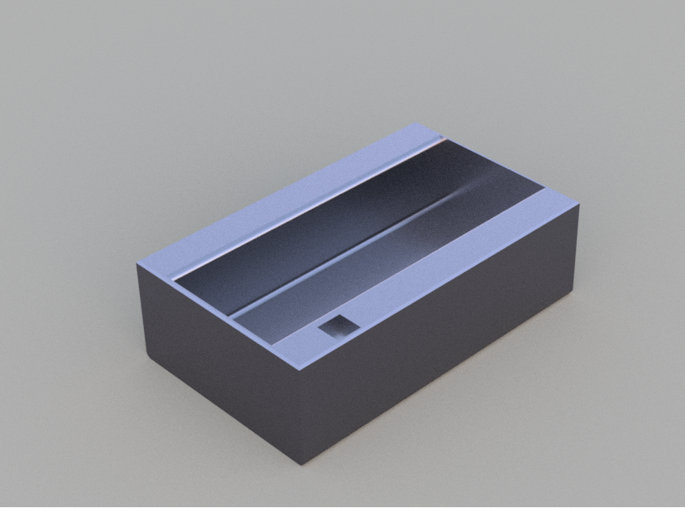

# N20 Motor Gear Mount + Pinecil Holder

Worked on the motor mount.

I first spent some time researching N20 motor dimensions and checking different datasheets to make sure the measurements were accurate. After that, I designed this mount specifically around the N20 geared motor.

At first glance it might look like a very simple part, but getting the dimensions right took quite a bit of trial and error. Small mistakes in hole spacing or motor tolerances can make the motor either too loose or impossible to fit.

To verify the design, I tested the design with a real N20 motor before finalizing it.

## Why I Made This

I'm currently building a line follower robot, and I needed a reliable way to mount N20 motors to the chassis. Instead of using zip ties or generic brackets, I wanted a mount designed specifically for my robot so assembly would be cleaner and more rigid.

## Features

* Designed specifically for N20 geared motors
* Compact and lightweight
* Easy to integrate into custom robot chassis
* Secure motor fit
* Tested with a real motor before finalizing

## Use Case

This mount will be used in my line follower robot to hold the drive motors in place. A rigid motor mount helps reduce unwanted movement and keeps wheel alignment consistent, which is important for accurate line following.

Although it looks like a simple part, around 2 hours went into measuring, modeling, testing, and refining it to ensure a proper fit.

---

# Pinecil Case

Here is the case:

I made this Pinecil case that I've been wanting to design for quite a while. My Pinecil usually just sits on my desk, which isn't ideal since it can get knocked around or fall off the table.

## CAD Design

The design was made specifically around the dimensions of the Pinecil so that it would hold the soldering iron securely while still being easy to access.

## Rendered Model

I spent quite a bit of time learning how to create proper renders. Setting up scenes, camera angles, lighting, and materials was surprisingly confusing at first, but it was worth learning because it makes showcasing designs much easier.

## Finished Print

The finished print came out well and fits the Pinecil as intended.

Here's another view of the printed case in use.

## Documentation

After finishing the design and printing process, I spent about 10 minutes taking photos, organizing files, writing this README, and documenting everything properly.

I also recorded a short video and uploaded it to YouTube:

https://www.youtube.com/shorts/cXh-5Utj3hs

The camera quality isn't amazing, but it shows the design and fitment clearly.

Overall, these are fairly simple projects, but they solve real problems for my robot builds and electronics workspace while helping me improve my CAD and rendering skills.
