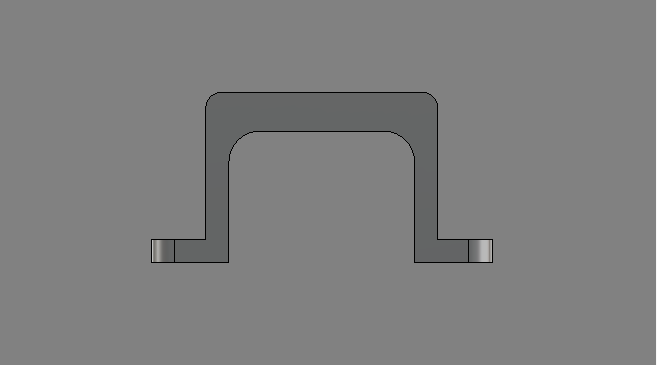
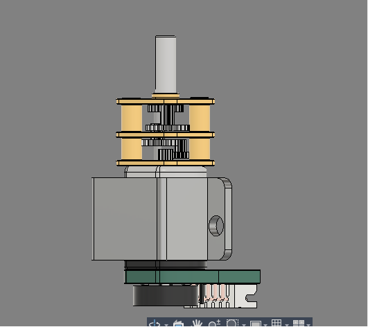

# N20 Motor Gear Mount

Worked on the motor mount.

I first spent some time researching N20 motor dimensions and checking different datasheets to make sure the measurements were accurate. After that, I designed this mount specifically around the N20 geared motor.

At first glance it might look like a very simple part, but getting the dimensions right took quite a bit of trial and error. Small mistakes in hole spacing or motor tolerances can make the motor either too loose or impossible to fit.

To verify the design, I tested it with an N20 motor model.

## Why I Made This

I'm currently building a line follower robot, and I needed a reliable way to mount N20 motors to the chassis. Instead of using zip ties or generic brackets, I wanted a mount designed specifically for my robot so assembly would be cleaner and more rigid.

## Features

- Designed specifically for N20 geared motors
- Compact and lightweight
- Easy to integrate into custom robot chassis
- Secure motor fit
- Tested with a real motor before finalizing

## Use Case

This mount will be used in my line follower robot to hold the drive motors in place. A rigid motor mount helps reduce unwanted movement and keeps wheel alignment consistent, which is important for accurate line following.

Simple part, but a necessary one. Getting the basics right saves a lot of headaches later in the build.
